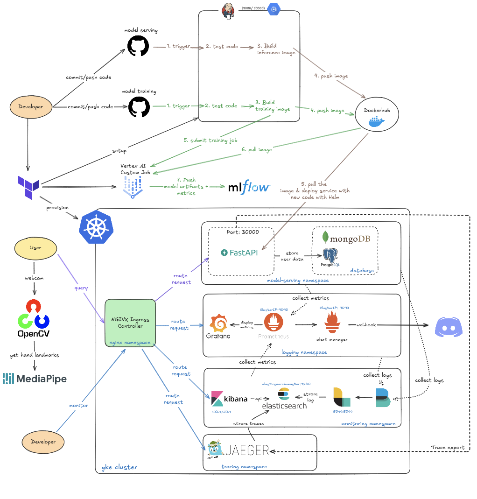

# Hand Gesture Detection API

A real-time hand gesture recognition system featuring a Python OpenCV client and a FastAPI backend, deployed on Google Kubernetes Engine (GKE) via a fully automated CI/CD pipeline with Jenkins.

---

## Architecture Overview
<div align="center">
  
  <p><em>Figure 1: Complete architecture for serving ASL hand gesture detection API</em></p>
</div>

This project is composed of several key components that work together to provide a seamless development and deployment experience:

-   **Webcam Client (`app.py`):** Captures video from a webcam, uses `mediapipe` to detect hand landmarks, and streams the data to the backend via WebSockets.
-   **API Backend (`main.py`):** A `FastAPI` application that receives landmark data, uses a pre-trained model to classify the hand gesture, and returns the prediction.
-   **CI/CD Pipeline (`Jenkinsfile`):** An automated Jenkins pipeline that tests the code, builds a Docker image, and deploys the application to Kubernetes.
-   **Infrastructure as Code (`iac/`):** Terraform scripts to provision the necessary cloud infrastructure on GCP, including the GKE cluster and the Jenkins VM.
-   **Kubernetes Deployment (`helm-charts/`):** A Helm chart that defines all the necessary Kubernetes resources for a scalable and secure deployment.

---

## Getting Started

-   **[1. Local Development & Testing Guide](docs/1.%20LOCAL_DEVELOPMENT.md)**: Instructions for running the services on a local machine and testing with Minikube.
-   **[2. Infrastructure Setup Guide](docs/2.%20INFRASTRUCTURE_SETUP.md)**: One-time setup for provisioning GCP resources with Terraform.
-   **[3. Jenkins Instance Setup Guide](docs/3.%20JENKINS_SETUP.md)**: One-time setup for configuring the Jenkins VM and its credentials.
-   **[4. Kubernetes Deployment Guide (Helm)](docs/4.%20HELM_AND_KUBERNETES.md)**: A detailed explanation of the Helm chart and Kubernetes resources.

---

## Project Structure

```
.
├── api/                  # FastAPI application source code
├── app.py                # OpenCV client application
├── docs/                 # Detailed setup and development guides
├── helm-charts/          # Helm charts for Kubernetes deployment
│   └── asl/
├── iac/                  # Terraform files for GCP infrastructure
├── model/                # Pre-trained ML models
├── Dockerfile            # Defines the container image for the API
├── Jenkinsfile           # Declarative CI/CD pipeline for Jenkins
├── main.py               # FastAPI application entry point
└── README.md             # This file
```

---

## CI/CD Pipeline

The `Jenkinsfile` defines an automated, multi-branch pipeline that handles the entire lifecycle of the application. For a full breakdown of the pipeline's logic and stages, see the main `Jenkinsfile`.

## Kubernetes Deployment (Helm)

The application is deployed using the Helm chart located in `helm-charts/asl`. For a detailed explanation of the chart and the Kubernetes resources it creates, please see the **[Kubernetes Deployment Guide](docs/4.%20HELM_AND_KUBERNETES.md)**.
