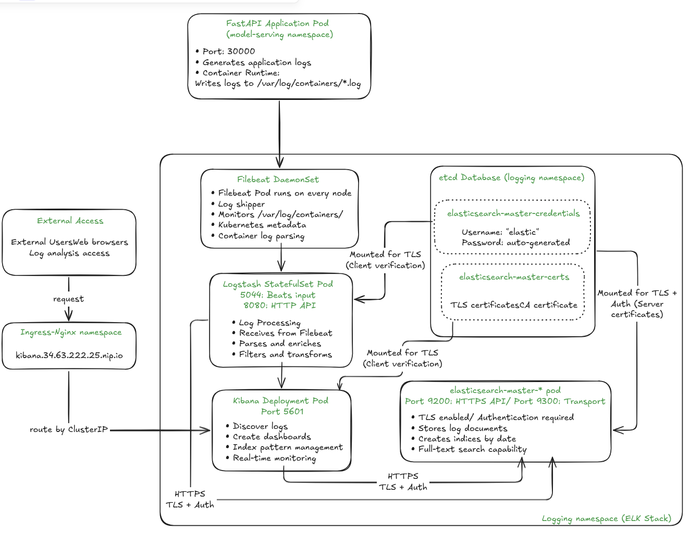

# 5. Logging with ELK Stack

This guide explains how to set up a comprehensive logging stack for your Kubernetes cluster using the **ELK Stack** (Elasticsearch, Logstash, Kibana). This setup provides centralized log collection, processing, and visualization for all your applications and system components.

We will deploy the logging stack in a `logging` namespace and expose Kibana through Nginx Ingress for easy web access.

---

## 1. Architecture Overview

<div align="center">
  
  <p><em>ELK Architecture Overview</em></p>
</div>

Our logging architecture consists of:
- **Elasticsearch** - Distributed search and analytics engine for storing logsDaniel
- **Filebeat** - Lightweight log shipper deployed as DaemonSet on all nodes
- **Logstash** - Data processing pipeline for parsing and enriching logs (optional)
- **Kibana** - Web interface for searching and visualizing logs

**Data Flow:**
```
Container Logs → Filebeat → [Logstash] → Elasticsearch → Kibana
```

---

## 2. Prerequisites

Ensure you have:
- A running Kubernetes cluster with Nginx Ingress Controller installed
- Helm 3.x installed
- `kubectl` configured to access your cluster
- Sufficient cluster resources (Elasticsearch is resource-intensive)

---

## 3. Setup ELK Stack

### Create the Namespace
```bash
kubectl create namespace logging
```

### Add the Elastic Helm Repository

```bash
helm repo add elastic https://helm.elastic.co
helm repo update
```

---

## 4. Deploy Elasticsearch

Elasticsearch is the core component that stores and indexes all log data.

```bash
helm install elasticsearch elastic/elasticsearch -n logging -f helm-charts/elk/elasticsearch/values.yml
```

**Wait for Elasticsearch to be ready:**
```bash
kubectl get pods -n logging -w
# Wait until elasticsearch-master-0 is Running
```

**Get Elasticsearch credentials:**
```bash
# Username (usually 'elastic')
kubectl get secret elasticsearch-master-credentials -n logging -o jsonpath='{.data.username}' | base64 --decode; echo

# Password
kubectl get secret elasticsearch-master-credentials -n logging -o jsonpath='{.data.password}' | base64 --decode; echo
```

---

## 5. Deploy Kibana with Nginx Ingress

Kibana provides the web interface for log visualization and analysis.

```bash
helm install kibana elastic/kibana -n logging \
  -f helm-charts/elk/kibana/values.yml
```

**Access Kibana:**
- **URL**: `http://kibana.<EXTERNAL_IP_OF_NGINX>.nip.io`
- **Username**: `elastic` (from Elasticsearch credentials)
- **Password**: (from Elasticsearch credentials above)

---

## 6. Deploy Filebeat (EFK Stack)

For a simple setup, deploy Filebeat to send logs directly to Elasticsearch:

```bash
    helm install filebeat elastic/filebeat -n logging \
      --set filebeat.autodiscover.providers[0].node="${NODE_NAME}" \
      --set filebeat.autodiscover.providers[0].type="kubernetes" \
      --set filebeat.autodiscover.providers[0].templates[0].config[0].paths[0]="/var/log/containers/*.log" \
      --set "filebeat.autodiscover.providers[0].templates[0].config[0].type"="container"
```

---

## 7. Advanced Setup: Deploy Logstash (EFLK Stack)

For advanced log processing, add Logstash between Filebeat and Elasticsearch:

### Deploy Logstash
```bash
helm install logstash elastic/logstash -n logging \
  -f helm-charts/logstash/values.yml
```

### Deploy Filebeat (configured for Logstash)
```bash
helm install filebeat elastic/filebeat -n logging \
  --set filebeat.autodiscover.providers[0].node="${NODE_NAME}" \
  --set filebeat.autodiscover.providers[0].type="kubernetes" \
  --set filebeat.autodiscover.providers[0].templates[0].config[0].paths[0]="/var/log/containers/*.log" \
  --set "filebeat.autodiscover.providers[0].templates[0].config[0].type"="container" \
  --set "output.elasticsearch.enabled=false" \
  --set "output.logstash.enabled=true" \
  --set "output.logstash.hosts[0]"="logstash-logstash:5044"
```

---

## 8. Verify Deployment

### Check All Pods
```bash
kubectl get pods -n logging
```

Expected output:
```
NAME                             READY   STATUS    RESTARTS   AGE
elasticsearch-master-0           1/1     Running   0          10m
filebeat-filebeat-xxxxx          1/1     Running   0          5m
kibana-kibana-xxxxxxxxx-xxxxx    1/1     Running   0          8m
logstash-logstash-0              1/1     Running   0          6m  # (if using EFLK)
```

### Check Services
```bash
kubectl get svc -n logging
```

### Verify Log Ingestion
```bash
# Get Elasticsearch credentials
ELASTIC_USER=$(kubectl get secret elasticsearch-master-credentials -n logging -o jsonpath='{.data.username}' | base64 --decode)
ELASTIC_PASS=$(kubectl get secret elasticsearch-master-credentials -n logging -o jsonpath='{.data.password}' | base64 --decode)

# Port-forward to Elasticsearch (in another terminal)
kubectl port-forward svc/elasticsearch-master -n logging 9200:9200

# Check indices (should show log indices)
curl -u $ELASTIC_USER:$ELASTIC_PASS "http://localhost:9200/_cat/indices?v"
```

---

## 9. Using Kibana for Log Analysis

### Initial Setup
1. Navigate to `http://kibana.34.63.222.25.nip.io`
2. Login with Elasticsearch credentials
3. Go to **Stack Management** → **Index Patterns**
4. Create index pattern: `filebeat-*` or `logstash-*h`
5. Select `@timestamp` as time field

### Common Log Queries
In Kibana's **Discover** section:

**Filter by Application:**
```
kubernetes.labels.app: "asl"
```

**Filter by Log Level:**
```
log.level: "ERROR"
```

**Filter by Namespace:**
```
kubernetes.namespace: "default"
```

**Search Log Content:**
```
message: "gesture detection"
```

### Creating Dashboards
1. Go to **Dashboard** → **Create dashboard**
2. Add visualizations for:
   - Log volume over time
   - Error rate by application
   - Top error messages
   - Application performance metrics

---

## 10. Maintenance Commands

### Check Logging Stack Status
```bash
# Check all logging pods
kubectl get pods -n logging

# Check services and ingress
kubectl get svc,ingress -n logging

# Check Elasticsearch cluster health
kubectl exec -it elasticsearch-master-0 -n logging -- curl -u elastic:$ELASTIC_PASS http://localhost:9200/_cluster/health?pretty
```

### Upgrade Components
```bash
# Upgrade Elasticsearch
helm upgrade elasticsearch elastic/elasticsearch -n logging

# Upgrade Kibana
helm upgrade kibana elastic/kibana -n logging -f helm-charts/elk/kibana/values.yml

# Upgrade Filebeat
helm upgrade filebeat elastic/filebeat -n logging
```

### Clean Up Old Indices
```bash
# Delete indices older than 30 days (example)
curl -u $ELASTIC_USER:$ELASTIC_PASS -X DELETE "http://localhost:9200/filebeat-$(date -d '30 days ago' +%Y.%m.%d)"
```

---

## 11. Troubleshooting

### Common Issues

**Elasticsearch Pod CrashLooping:**
- Check resource limits and requests
- Verify sufficient disk space
- Check Java heap size settings

**Filebeat Not Shipping Logs:**
```bash
# Check Filebeat logs
kubectl logs -n logging -l app=filebeat-filebeat

# Verify Filebeat configuration
kubectl describe configmap filebeat-filebeat-config -n logging
```

**Kibana Can't Connect to Elasticsearch:**
```bash
# Check Kibana logs
kubectl logs -n logging -l app=kibana

# Verify Elasticsearch service
kubectl get svc elasticsearch-master -n logging
```

**No Logs Appearing in Kibana:**
- Verify index patterns are correct
- Check time range in Kibana
- Ensure applications are generating logs
- Verify Filebeat is discovering containers

### Performance Tuning

**Elasticsearch:**
- Increase heap size for better performance
- Add more replicas for high availability
- Configure index lifecycle management

**Filebeat:**
- Adjust harvester limits
- Configure multiline parsing for stack traces
- Use processors to filter unnecessary logs

---

## 12. Security Considerations

### Enable Security Features
```bash
# Enable X-Pack security (production)
helm upgrade elasticsearch elastic/elasticsearch -n logging \
  --set xpack.security.enabled=true \
  --set xpack.security.transport.ssl.enabled=true
```

### Network Policies
Consider implementing Kubernetes Network Policies to restrict traffic between logging components.

### Log Retention
Configure index lifecycle management to automatically delete old logs and manage storage costs.

---

This logging setup provides comprehensive log collection and analysis capabilities for your Kubernetes cluster, with easy web access through Nginx Ingress and powerful search capabilities through Kibana.