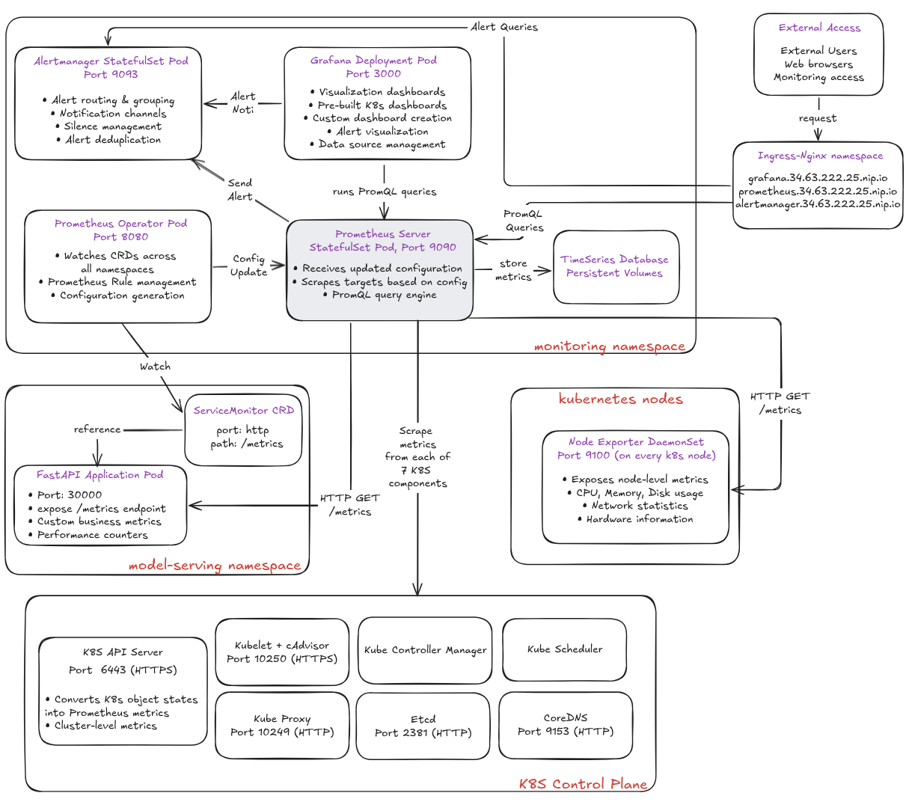

# 6. Monitoring with Prometheus and Grafana

This guide explains how to set up our comprehensive monitoring stack using **Prometheus** for collecting time-series metrics, **Alertmanager** for handling alerts, and **Grafana** for visualizing data.

We deploy our monitoring stack in a `monitoring` namespace and expose all services through Nginx Ingress.

---

## 1. Prerequisites

Our setup requires:
- Running Kubernetes cluster with NGINX Ingress Controller
- Helm 3.x
- `kubectl` configured for cluster access

---

## 2. Setup Architecture

Our monitoring stack uses the **kube-prometheus-stack** Helm chart for:

- **Unified Configuration**: Single `values.yml` for all components
- **Dependency Management**: Automatic component dependency handling
- **Version Compatibility**: Ensures component compatibility
- **Simplified Updates**: Single command updates

### 2.2 Deployment Steps

```bash
# 1. Create namespace
kubectl create namespace monitoring

# 2. Add Helm repository
helm repo add prometheus-community https://prometheus-community.github.io/helm-charts
helm repo update

# 3. Deploy stack
helm install prometheus-stack prometheus-community/kube-prometheus-stack \
  --namespace monitoring \
  --values helm-charts/prometheus/values.yml \
  --create-namespace

# 4. Verify deployment
kubectl get pods,svc,ingress -n monitoring

### Uninstall Monitoring Stack + delete monitoring
helm uninstall prometheus -n monitoring
kubectl delete namespace monitoring
```

### 2.3 Architecture Overview

<div align="center">
  
  <p><em>Prometheus Architecture Overview</em></p>
</div>

Our monitoring stack consists of these key layers:

**🌐 External Access**
```
Users → NGINX Ingress Controller → Monitoring Components
├── grafana.34.63.222.25.nip.io → Grafana (Port 3000)
├── prometheus.34.63.222.25.nip.io → Prometheus (Port 9090)  
└── alertmanager.34.63.222.25.nip.io → Alertmanager (Port 9093)
```

**📊 Monitoring Namespace Components**
| Component | Type | Port | Purpose |
|-----------|------|------|---------|
| Prometheus Server | StatefulSet | 9090 | Metrics collection & storage |
| Grafana | Deployment | 3000 | Visualization dashboards |
| Alertmanager | StatefulSet | 9093 | Alert routing & grouping |
| Prometheus Operator | Deployment | 8080 | CRD management & config generation |
| Kube State Metrics | Deployment | 8080 | K8s object state metrics |
| Node Exporter | DaemonSet | 9100 | Node-level system metrics |

**🔧 Control Plane Monitoring (All Enabled)**
- **K8s API Server** (6443/HTTPS): Cluster performance metrics
- **Kubelet + cAdvisor** (10250/HTTPS): Container & node metrics  
- **Etcd** (2381/HTTP): Database performance
- **CoreDNS** (9153/HTTP): DNS query metrics
- **Kube Proxy** (10249/HTTP): Network proxy stats
- **Controller Manager & Scheduler** (Dynamic ports): Control loop metrics

**📈 Data Flow**
1. **Service Discovery**: Prometheus Operator watches ServiceMonitor CRDs → Generates configs
2. **Metrics Collection**: Prometheus scrapes all targets (nodes, control plane, apps)
3. **Storage**: Metrics stored in time-series database with retention policies
4. **Visualization**: Grafana queries Prometheus → Renders dashboards
5. **Alerting**: Prometheus evaluates rules → Sends alerts to Alertmanager

**Key Point**: Prometheus scrapes **both** K8s API Server (performance metrics) AND Kube State Metrics (object states) for complete visibility.

### 2.4 ServiceMonitor Configuration

Our applications use ServiceMonitor CRDs for automatic discovery:

```yaml
# helm-charts/asl/templates/servicemonitor.yaml
apiVersion: monitoring.coreos.com/v1
kind: ServiceMonitor
metadata:
  name: {{ .Release.Name }}-servicemonitor
  namespace: {{ .Release.Namespace }}
  labels:
    release: prometheus  # Required for Prometheus Operator discovery
spec:
  namespaceSelector:
    matchNames:
      - {{ .Release.Namespace }}
  selector:
    matchLabels:
      app: {{ .Release.Name }}
  endpoints:
    - port: http
      path: /metrics
      interval: 15s
```

### 2.5 Configuration Management

#### **Helm Values Structure**
```yaml
# helm-charts/prometheus/values.yml
prometheus:
  enabled: true
  ingress:
    enabled: true
    hosts:
      - prometheus.34.63.222.25.nip.io

grafana:
  enabled: true
  defaultDashboardsEnabled: true
  ingress:
    enabled: true
    hosts:
      - grafana.34.63.222.25.nip.io

alertmanager:
  enabled: true
  ingress:
    enabled: true
    hosts:
      - alertmanager.34.63.222.25.nip.io

# Control Plane Monitoring (All Enabled)
kubeApiServer:
  enabled: true
kubelet:
  enabled: true
kubeControllerManager:
  enabled: true
kubeScheduler:
  enabled: true
kubeProxy:
  enabled: true
kubeEtcd:
  enabled: true
coreDns:
  enabled: true
```

---

## 3. Application Monitoring

### How ServiceMonitors Work

1. **Discovery**: Prometheus Operator watches for ServiceMonitor CRDs with label `release: prometheus`
2. **Configuration**: Automatically generates Prometheus scrape configs
3. **Scraping**: Prometheus contacts Service ClusterIP on specified port/path
4. **Routing**: kube-proxy forwards requests to backend pods

### Verification Commands

```bash
# Check ServiceMonitors
kubectl get servicemonitors -A

# Verify scraping targets in Prometheus UI
kubectl -n monitoring port-forward svc/prometheus-stack-prometheus 9090:9090
# Visit http://localhost:9090/targets

# Test if our app is being scraped
up{job="<app-name>-servicemonitor"}
```

---

## 4. Access URLs

```bash
# Get current admin password
kubectl get secret prometheus-grafana -n monitoring -o jsonpath="{.data.admin-password}" | base64 --decode; echo
```

Our monitoring stack is accessible via:

- **Grafana**: https://grafana.34.63.222.25.nip.io (admin/prom-operator)
- **Prometheus**: https://prometheus.34.63.222.25.nip.io
- **Alertmanager**: https://alertmanager.34.63.222.25.nip.io

---

## 5. Essential PromQL Queries

### Basic Health Checks
```promql
# Check if our app is being scraped
up{job="hand-gesture-servicemonitor"}

# Request rate per second
sum(rate(http_requests_total{job="hand-gesture-servicemonitor"}[1m]))

# Error rate percentage
sum(rate(http_requests_total{job="hand-gesture-servicemonitor",status!~"2.."}[5m])) /
sum(rate(http_requests_total{job="hand-gesture-servicemonitor"}[5m])) * 100
```

### Performance Metrics
```promql
# 95th percentile response time
histogram_quantile(0.95, 
  sum by (le)(rate(http_request_duration_seconds_bucket{job="hand-gesture-servicemonitor"}[5m]))
)

# CPU usage
rate(process_cpu_seconds_total{job="hand-gesture-servicemonitor"}[1m])

# Memory usage
process_resident_memory_bytes{job="hand-gesture-servicemonitor"}
```

### Traffic Analysis
```promql
# Daily request volume
sum(increase(http_requests_total{job="hand-gesture-servicemonitor"}[24h]))

# Requests by endpoint
sum by (handler)(rate(http_requests_total{job="hand-gesture-servicemonitor"}[5m]))
```

---

## 6. PromQL Functions Reference

| **Function** | **Purpose** | **Example** |
|-------------|-------------|-------------|
| `rate()` | Per-second rate over time window | `rate(http_requests_total[5m])` |
| `sum()` | Aggregate current values | `sum(memory_usage_bytes)` |
| `increase()` | Total increase over time range | `increase(requests_total[1h])` |
| `histogram_quantile()` | Calculate percentiles | `histogram_quantile(0.95, buckets)` |